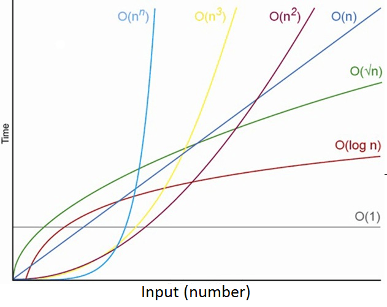

16/09/2021
# Algoritmos y Estructuras de Datos
Los algoritmos y las estructuras de datos forman parte de la preparación elemental de un ingeniero en sistemas computacionales, estas dos materias, cuando las curse durante la carrera, me parecieron sumamente interesantes, aun así, por lo que he logrado notar en algunas de las juntas o videos que he visto sobre las grandes empresas, te suelen preguntar el concepto en general de muchos de los algoritmos y estructuras de datos, sus casos de uso y en cuales no se utilizan, además de su notación, es por ello que he decidido basarme en la página **Geeks for Geeks** para hacer un resumen de los más importantes. 

Un **algoritmo** es una serie de pasos secuencial, ordenada y finita, que está diseñado para solucionar un problema. 

Una **estructura de datos** es una forma de organizar la información para manipularla, organizarla, buscar e insertar datos de manera eficiente.
## Algoritmos
Antes de comenzar a ver los algoritmos, debemos mencionar que existe una notación conocida como BigO donde se menciona en terminos de N, de manera muy general cual es la complejidad computacional de cada algorimo, esta imagen puede ser de gran ayuda:
<p align="center">
  
</p>

En la imagen falta la notación **O(n log n)**, esta se ubica debajo de **O(n^2)** y arriba de **O(n)**

### Searching and Sorting (Búsqueda y Ordenamiento):
#### Linear Search (Búsqueda Lineal)
Tomando en cuenta que tenemos un arreglo o lista enlazada de n elementos, se nos pide buscar un valor ‘a’ dentro de esta, la opción más natural es pararnos en el primer elemento de la lista (el que está más a la izquierda) e ir avanzando de uno en uno hasta llegar al elemento que estamos buscando, en el caso de que encuentre el numero, regresa el index en el que se encuentra, en el caso contrario, regresa un -1.

**Complejidad:** O(n)

La búsqueda lineal es un algoritmo muy lento, es por ello que casi no se utiliza, existen dos maneras de “mejorarlo”, la primera es preguntando si el elemento se encuentra en alguna de las orillas del arreglo (Su peor caso sería O(n-1)) y la segunda es paralelizando el algoritmo.

**El código en C es el siguiente:**
``` 
int search(int arr[], int n, int x) //arr[] es el arreglo, n es el numero de elementos en el y x es el numero que se esta buscando
{
    int i;
    for (i = 0; i < n; i++)
        if (arr[i] == x)
            return i;
    return -1;
}
```
<p align="center">
  
</p>

#### Binary Search (Búsqueda Binaria)
Tomando en cuenta un **arreglo ordenado**, debemos de buscar un elemento en esté, lo primero que tenemos que hacer es dividir el arreglo en dos partes, tomando un elemento de en medio, si el que estamos buscando es menor a esté elemento seleccionado, significa que el elemento a buscar se encuentra en el grupo de la izquierda, de lo contrario, es pertenece al segundo grupo, este algoritmo se pude realizar *recursivamente* o *cíclicamente*.

Considero que es un algoritmo muy rápido de utilizar, su única desventaja es que el arreglo debe estar ya ordenado (los algoritmos de ordenamiento están más adelante), también, se puede cambiar un poco el algoritmo, para que en el caso de que el elemento se encuentre en medio, regrese inmediatamente su índice, de esta manera su complejidad podría llegar a ser *constante*

**Complejidad:** O(log n)

**El código *Recursivo* en C es el siguiente:**
``` 
int binarySearch(int arr[], int l, int r, int x)
{
    if (r >= l) {
        int mid = l + (r - l) / 2;
  
        if (arr[mid] == x)
            return mid;
  
        if (arr[mid] > x)
            return binarySearch(arr, l, mid - 1, x);
  
        return binarySearch(arr, mid + 1, r, x);
    }
    return -1;
}

//Primera llamada en el main
 int result = binarySearch(arr, 0, n - 1, x);
``` 
**El código *Recursivo* en C es el siguiente:**
``` 
int binarySearch(int arr[], int l, int r, int x)
{
    while (l <= r) {
        int m = l + (r - l) / 2;

        if (arr[m] == x)
            return m;
  
        if (arr[m] < x)
            l = m + 1;
  
        else
            r = m - 1;
    }
  
    return -1;
}
//Primera llamada en el main
int result = binarySearch(arr, 0, n - 1, x);
``` 
**Paradigma del Algoritmo:** Decrease and Conquer.
<p align="center">
  
</p>

**Nota Importante:** *Puedes implementar este algoritmo utilizando la estructura de datos Árbol Binario de Búsqueda*

### Jump Search
Este algoritmo es interesante ya que trata de evitar que pases por todos los elementos de un *arreglo ordenado*, para evitar eso lo que hace es dar saltos e itera, lo cual reduce considerablemente el número de operaciones cuando se compara con una búsqueda lineal.

**Complejidad:**O(sqrt(n))

*Es menos eficiente que Busqueda Binaria*

**El código en Python es el siguiente:**
``` 
def jumpSearch( arr , x , n ):     
    step = math.sqrt(n)

    prev = 0
    while arr[int(min(step, n)-1)] < x:
        prev = step
        step += math.sqrt(n)
        if prev >= n:
            return -1
     
    while arr[int(prev)] < x:
        prev += 1
             
        if prev == min(step, n):
            return -1
     
    if arr[int(prev)] == x:
        return prev
     
    return -1
```
### Exponential Search (Busqueda Exponencial)
Busqueda exponencial es un algoritmo para *arreglos ordenados* que junta básicamente a *jump y binary*, ya que se posiciona en la posición 1 (indexado en cero y comprobando que el elemento no esté ahí) del arreglo, y va avanzando exponencialmente multiplicando i por 2, hasta que se llegue al valor deseado o a uno superior, si se llega a al esperado solo se regresa el index, de lo contrario, se represa el índice anterior y actual, se formara un rango donde es seguro que el elemento se encuentra, es ahí donde se aplica la búsqueda binaria.

**Complejidad:** O(Log n) 

**El código en Python es el siguiente:**
``` 
def exponentialSearch(arr, n, x):
    if arr[0] == x:
        return 0

    i = 1
    while i < n and arr[i] <= x:
        i = i * 2
     
    return binarySearch( arr, i / 2,
                         min(i, n-1), x)
``` 
### Bubble Sort (Ordenamiento por el Método de Burbuja)
Este algoritmo debe su nombre a que los elementos más ligeros tienen a “Subir” como una burbuja y los más ligeros se quedan en un solo lugar, en este caso, como estamos hablando de arreglos, en lugar de “subir”, el número se hace a la izquierda.

Lo que hace este algoritmo es tomar el primer par de números y compararlos, pone más a la izquierda el menor y así avanza con el resto del arreglo; Este es un algoritmo **sumamente lento**, pero es una buena introducción al ordenamiento.

**Complejidad:** O(n^2), Si el arreglo ya esta ordenado, la complejidad es *O(n)*

**El código en C es el siguiente:**
```
void bubbleSort(int arr[], int n)
{
   int i, j;
   for (i = 0; i < n-1; i++)      
  
       for (j = 0; j < n-i-1; j++) 
           if (arr[j] > arr[j+1])
              swap(&arr[j], &arr[j+1]);
}

void swap(int *xp, int *yp)
{
    int temp = *xp;
    *xp = *yp;
    *yp = temp;
}
```
### Insertion Sort
El método de inserción es un método muy natural, con esto me refiero a que, si no sabes nada de algoritmos, puede que realices un programa un poco similar a este, donde tomas un número, lo comparas con sus anteriores y si es menor, lo recorres hasta donde debe de ir con ayuda de un auxiliar, el nombre surge debido a que tomas un elemento, lo sacas y lo vueles a colocar *insertándolo* en la posición a la que corresponde.

**Complejidad:** O(n^2)

Es un algoritmo igual de tardado que el anterior, pero es mucho más interesante.

**El código en C es el siguiente:**
```
void insertionSort(int arr[], int n)
{
    int i, key, j;
    for (i = 1; i < n; i++) {
        key = arr[i];
        j = i - 1;
 
        while (j >= 0 && arr[j] > key) {
            arr[j + 1] = arr[j];
            j = j - 1;
        }
        arr[j + 1] = key;
    }
}
```
### Selection Sort
Este método es similar al anterior, solo que **En el anterior** se tomaba un elemento, se acomodaba y se seguía con el elemento siguiente, en este nuevo algoritmo, **se busca el número menor** luego se coloca al inicio, para continuar con el siguiente más chico y colocarlo después, pero realmente son muy parecidos y podemos llegar a confundirnos.

**Complejidad:** O(n^2)

**El código en C es el siguiente:**
```
void selectionSort(int arr[], int n)
{
    int i, j, min_idx;

    for (i = 0; i < n-1; i++)
    {
        min_idx = i;
        for (j = i+1; j < n; j++)
          if (arr[j] < arr[min_idx])
            min_idx = j;
            
        swap(&arr[min_idx], &arr[i]);
    }
}
```